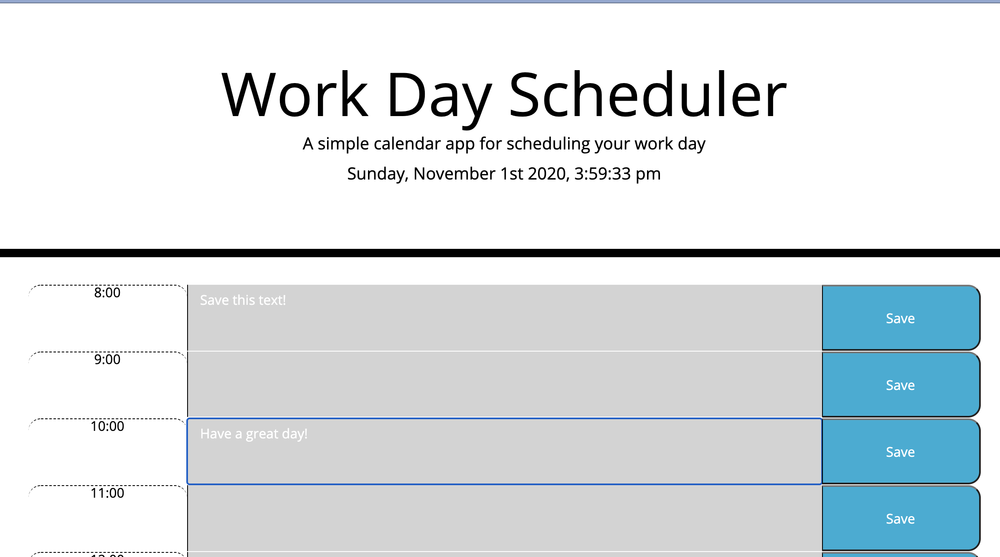

# DailyPlanner
Deployed at the below link:
https://jordanbehn.github.io/DailyPlanner/

This application is a daily planner. It displays today's date and time at the top of the page. It also displays time blocks for 8:00 AM through 7:00 PM and allows the user to input text into these blocks. The text can be saved in local storage via a button press such that the data will persist on refreshing the page.